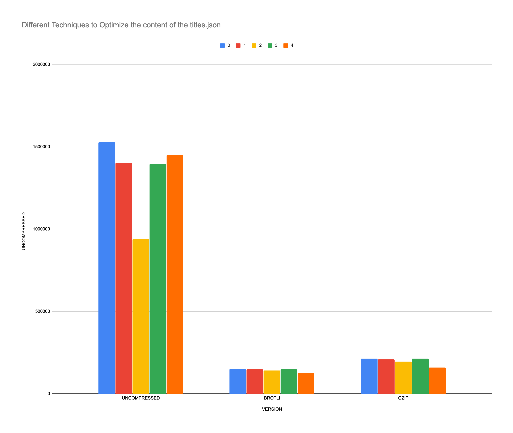
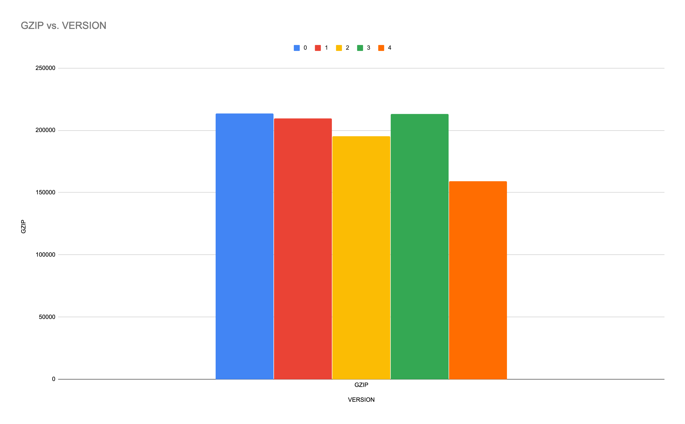

# optimize titles.json

In [Yari](https://github.com/mdn/yari), as a build step we produce a
`build/$locale/titles.json` file which get downloaded, with XHR, in
the browser so it matters that it's not unnecessarily big which means
due to network speed would be bad user experience.

## To run the experiment

Run:

    python 1.py  # generates 1.json
    python 2.py  # genetates 2.csv
    python 3.py  # generates 4.json
    python 4.py  # generates 4.json

Produce the table with:

    python table.py

Or just use `ls`:

    ls -ltrS

## Results

One version of the results as of today:



Exclusively `gzip` sizes:



Just the `.gz` versions:

```bash
▶ ls -ltrS *.gz
-rw-r--r--  1 peterbe  staff  158917 Jul 15 12:05 4.json.gz
-rw-r--r--  1 peterbe  staff  195261 Jul 15 11:59 2.csv.gz
-rw-r--r--  1 peterbe  staff  209658 Jul 15 11:56 1.json.gz
-rw-r--r--  1 peterbe  staff  213309 Jul 15 12:00 3.json.gz
-rw-r--r--  1 peterbe  staff  213342 Jul 15 11:54 0.json.gz
```

And pretty-printed sizes:

```bash
▶ ls -ltrSh *.gz
-rw-r--r--  1 peterbe  staff   155K Jul 15 12:05 4.json.gz
-rw-r--r--  1 peterbe  staff   191K Jul 15 11:59 2.csv.gz
-rw-r--r--  1 peterbe  staff   205K Jul 15 11:56 1.json.gz
-rw-r--r--  1 peterbe  staff   208K Jul 15 12:00 3.json.gz
-rw-r--r--  1 peterbe  staff   208K Jul 15 11:54 0.json.gz
```
